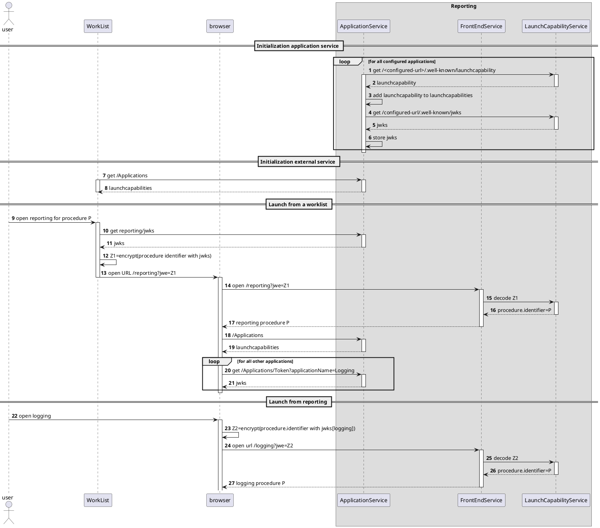

# Main [Doc](http://google.com/)

This is my main documentation

## Table of Contents

This is my TOC [content](http://google.com/)

#### Lightbox Demo

The following images source will render in image gallery:

# Test PlantUML diagram

